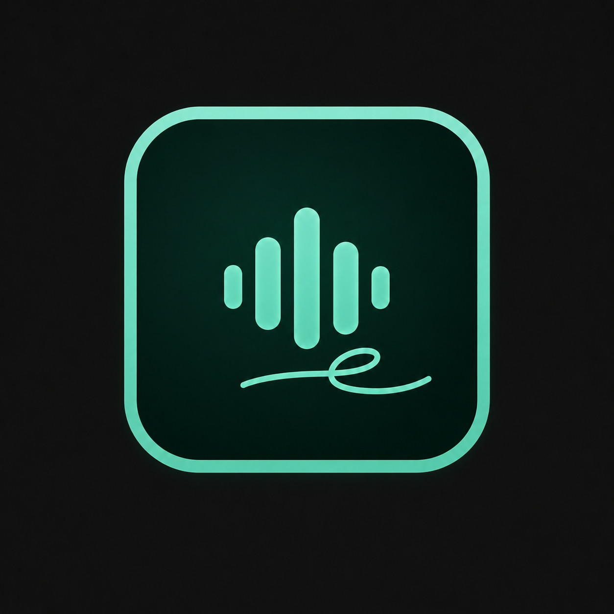
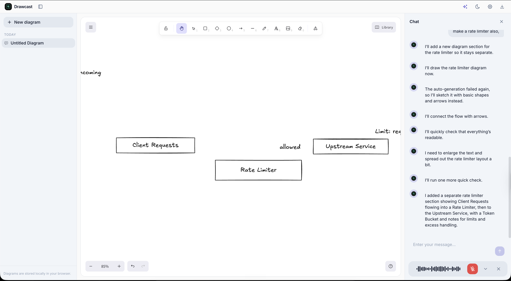

<div align="center">



# Drawcast

**The realtime whiteboard that listens.**  
**Beta / WIP:** useful for rough voice-led diagrams, still uneven around generation quality and recovery.

Talk through your idea — corrections, second thoughts, and all. It keeps up.

[Try it](https://drawwcast.vercel.app/) &middot; [Report Bug](https://github.com/suraj-xd/drawcast/issues)

</div>

---

## What is Drawcast?

Drawcast is a realtime AI whiteboard that turns voice into [Excalidraw](https://excalidraw.com) diagrams. Describe anything out loud — a system architecture, a business process, a research workflow — and it draws it as a clean, editable diagram.

No code. No syntax. No drag-and-drop.

## Current Beta Snapshot



Drawcast is still a beta/WIP build. The agent can draft diagrams from chat or voice, but complex requests may still fall back to rough basic-shape sketches while the canvas flow catches up.

## Features

- **Just talk** — mid-sentence corrections, filler words, backtracking — it reflects your intent, not your exact words
- **Incremental updates** — say "add X" and only X changes. Your manual edits are preserved
- **Real-time voice** — powered by OpenAI Realtime API for live conversation with the canvas agent
- **Local-first** — auto-saves to your browser via IndexedDB. No account, no server storage

## Tech Stack

| Layer | Tech |
|-------|------|
| Framework | [Next.js](https://nextjs.org) (App Router) |
| Canvas | [Excalidraw](https://excalidraw.com) |
| Layout | [Dagre](https://github.com/dagrejs/dagre) |
| Voice | [OpenAI Realtime API](https://platform.openai.com/docs/guides/realtime) |
| Storage | [Dexie](https://dexie.org) (IndexedDB) |
| Analytics | [Vercel Web Analytics](https://vercel.com/analytics) |

## Getting Started

```bash
git clone https://github.com/suraj-xd/drawcast.git
cd drawcast
npm install
cp .env.example .env
```

Add your API keys to `.env`, then:

```bash
npm run dev
```

Open [http://localhost:3000](http://localhost:3000).

### Environment Variables

```bash
OPENAI_API_KEY=           # Required — realtime voice + diagram generation
```

You can also set your OpenAI key in-app via the settings icon (top right).

## Project Structure

```
app/
  d/[id]/          # Editor page
  api/              # API routes (realtime session, diagram generation)
components/
  editor/           # Canvas, chat panel, sidebar, top bar
lib/
  ai/               # LLM integration, prompts
  engine/           # Canvas command handler
  realtime/         # OpenAI Realtime API tools
  render/           # Excalidraw element layout + rendering
hooks/              # React hooks (voice, auto-save, settings)
```

## Self-Hosting

1. Fork/clone this repo
2. Create a [Vercel](https://vercel.com) project and import it
3. Add `OPENAI_API_KEY` in Vercel project settings
4. Deploy

No database needed — all data lives in the user's browser.

## Contributing

PRs welcome. For anything beyond small fixes, open an issue first.

## License

[MIT](LICENSE)
